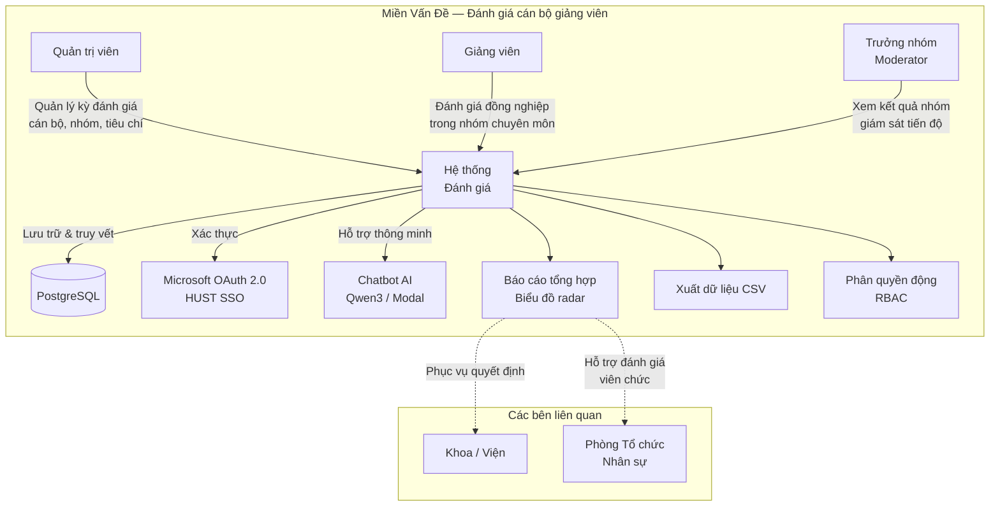

# Chương 1: Giới Thiệu

## 1.1 Đặt Vấn Đề

Trong các cơ sở giáo dục đại học, hoạt động đánh giá cán bộ giảng viên đóng vai trò thiết yếu trong việc đảm bảo chất lượng đào tạo, hỗ trợ quyết định bổ nhiệm, và phát triển đội ngũ nhân sự. Theo quy định của Bộ Giáo dục và Đào tạo, các trường đại học phải thực hiện đánh giá viên chức định kỳ hàng năm dựa trên nhiều tiêu chí: giảng dạy, phục vụ, tận tụy, hợp tác, và tuân thủ nội quy. Quy trình đánh giá đồng nghiệp (peer review) 360 độ — trong đó giảng viên đánh giá lẫn nhau trong cùng nhóm chuyên môn — là một phương pháp được nhiều đơn vị áp dụng nhằm đảm bảo tính khách quan và đa chiều.

Tuy nhiên, tại nhiều khoa và viện, quy trình này vẫn được thực hiện thủ công với các hạn chế nghiêm trọng:

- **Phân mảnh dữ liệu:** Điểm đánh giá được lưu trữ rải rác trong các file Excel, Google Sheets riêng lẻ theo từng kỳ. Không có nguồn dữ liệu chính thống duy nhất (single source of truth), dẫn đến khó khăn trong việc tra cứu và so sánh kết quả qua các kỳ.

- **Thiếu kiểm soát truy cập:** Tất cả người tham gia — quản trị viên, trưởng nhóm, và giảng viên — cùng chia sẻ một file dữ liệu chung mà không có phân quyền rõ ràng. Giảng viên có thể vô tình hoặc cố ý xem điểm đánh giá của người khác, vi phạm tính bảo mật của quy trình.

- **Thiếu tính minh bạch và truy vết:** Không có nhật ký ghi lại ai đã đánh giá ai, vào thời điểm nào, theo tiêu chí gì. Khi phát sinh tranh chấp về kết quả, không có bằng chứng để kiểm chứng.

- **Tốn thời gian tổng hợp báo cáo:** Cuối mỗi kỳ đánh giá, quản trị viên phải tổng hợp thủ công hàng trăm bản đánh giá, tính điểm trung bình, xếp hạng, và tạo biểu đồ — công việc mất nhiều ngày và dễ phát sinh sai sót.

- **Khó khăn trong xác thực người dùng:** Mỗi hệ thống nội bộ yêu cầu tài khoản riêng, tăng chi phí quản lý và giảm trải nghiệm người dùng. Giảng viên đã có tài khoản Microsoft thông qua trường nhưng không thể sử dụng để đăng nhập vào hệ thống đánh giá.

Ngoài ra, với sự phát triển mạnh mẽ của công nghệ trí tuệ nhân tạo (AI) và các mô hình ngôn ngữ lớn (LLM), việc tích hợp chatbot hỗ trợ vào hệ thống đánh giá mở ra khả năng nâng cao đáng kể trải nghiệm người dùng — cho phép giảng viên tra cứu thông tin, hiểu tiêu chí đánh giá, và nhận hỗ trợ bằng ngôn ngữ tự nhiên tiếng Việt mà không cần rời khỏi giao diện làm việc.

Xuất phát từ những vấn đề thực tiễn trên, khóa luận này đề xuất xây dựng **Hệ thống Đánh giá Cán bộ Giảng viên** (Staff Evaluation System) — một nền tảng web toàn diện, hiện đại, tích hợp AI, nhằm số hóa và chuẩn hóa toàn bộ quy trình đánh giá đồng nghiệp tại các đơn vị đào tạo.

### Sơ đồ miền vấn đề

---

## 1.2 Mục Tiêu Đề Tài

Khóa luận đặt ra các mục tiêu cụ thể sau:

**Mục tiêu 1 — Xây dựng nền tảng đánh giá đồng nghiệp trực tuyến:**
Phát triển hệ thống web cho phép giảng viên thực hiện đánh giá định lượng (thang điểm 0.0–4.0) cho đồng nghiệp trong cùng nhóm chuyên môn, trong khuôn khổ kỳ đánh giá được quản lý tập trung. Hệ thống hỗ trợ chế độ đánh giá ẩn danh (anonymous evaluation) để đảm bảo tính khách quan.

**Mục tiêu 2 — Thiết kế hệ thống phân quyền linh hoạt:**
Triển khai mô hình phân quyền dựa trên vai trò (RBAC) với ba cấp độ: admin, moderator, và user. Quyền truy cập kết quả được cấu hình động thông qua bảng `RolePermission` với bốn mức: `none`, `self`, `group`, `all` — cho phép thay đổi chính sách truy cập mà không cần triển khai lại mã nguồn.

**Mục tiêu 3 — Tích hợp xác thực đa nguồn:**
Hỗ trợ ba phương thức xác thực: đăng nhập cục bộ (email/mật khẩu), Microsoft OAuth 2.0 SSO, và HUST SSO — cho phép giảng viên sử dụng tài khoản tổ chức hiện có. Hệ thống tự động liên kết tài khoản người dùng với hồ sơ giảng viên thông qua email trường học.

**Mục tiêu 4 — Cung cấp báo cáo trực quan và xuất dữ liệu:**
Xây dựng bảng điều khiển (dashboard) với biểu đồ radar, biểu đồ cột, bảng xếp hạng, và chức năng xuất CSV — phục vụ nhu cầu tổng hợp kết quả và ra quyết định của ban lãnh đạo.

**Mục tiêu 5 — Tích hợp chatbot AI hỗ trợ người dùng:**
Triển khai chatbot sử dụng mô hình ngôn ngữ lớn Qwen3 (mã nguồn mở), phục vụ trên nền tảng GPU đám mây Modal, hỗ trợ tiếng Việt — cho phép giảng viên tra cứu thông tin đánh giá, hỏi đáp về quy trình, và nhận hướng dẫn sử dụng hệ thống bằng ngôn ngữ tự nhiên.

---

## 1.3 Phạm Vi Đề Tài

### Trong phạm vi

| Hạng mục | Mô tả |
|----------|-------|
| Đánh giá đồng nghiệp | Đánh giá định lượng 0.0–4.0 theo 5 tiêu chí, trong nhóm chuyên môn |
| Quản lý kỳ đánh giá | Tạo, kích hoạt, đóng kỳ đánh giá; hỗ trợ chế độ ẩn danh |
| Quản lý danh mục | CRUD cho cán bộ, đơn vị tổ chức, nhóm, câu hỏi đánh giá, môn học |
| Phân quyền | RBAC ba vai trò (admin/moderator/user) với quyền truy cập kết quả cấu hình động |
| Xác thực | Đăng nhập cục bộ, Microsoft OAuth 2.0, HUST SSO |
| Báo cáo | Biểu đồ radar, biểu đồ cột, bảng xếp hạng, xuất CSV |
| Chatbot AI | Hỗ trợ tiếng Việt, trả lời về quy trình và tiêu chí đánh giá |
| Triển khai | Docker Compose cho môi trường on-premise |

### Ngoài phạm vi

| Hạng mục | Lý do loại trừ |
|----------|---------------|
| Đánh giá định tính (free-text) | Tăng độ phức tạp phân tích; có thể mở rộng trong tương lai |
| Ứng dụng di động native | SPA responsive đủ đáp ứng nhu cầu sử dụng trên di động |
| Multi-tenant (đa đơn vị) | Phạm vi khóa luận tập trung vào một đơn vị đào tạo |
| Thông báo thời gian thực | Không thiết yếu cho quy trình đánh giá theo kỳ |
| Tích hợp hệ thống nhân sự | Yêu cầu quyền truy cập API của bên thứ ba mà khóa luận không có |

---

## 1.4 Phương Pháp Nghiên Cứu

Khóa luận áp dụng kết hợp các phương pháp sau:

**Phương pháp phân tích và thiết kế hướng đối tượng (OOA/OOD):** Hệ thống được phân tích thông qua các biểu đồ use case, biểu đồ trình tự (sequence diagram), và biểu đồ lớp. Thiết kế cơ sở dữ liệu quan hệ tuân thủ các dạng chuẩn hóa (normalization) và sử dụng ràng buộc toàn vẹn tại mức CSDL (unique constraints, foreign keys, composite unique).

**Phương pháp phát triển phần mềm Agile:** Dự án được chia thành các sprint ngắn, mỗi sprint tập trung vào một module chức năng. Các tính năng được phát triển theo mô hình lặp — xây dựng, kiểm thử, và cải tiến liên tục. Quản lý mã nguồn sử dụng Git với các nhánh tính năng (feature branches).

**Phương pháp kiểm thử đa tầng:** Áp dụng kiểm thử đơn vị (unit test) cho các service và controller với Jest (250 test cases), kiểm thử tích hợp cho luồng xác thực, và kiểm thử thủ công cho giao diện người dùng. Độ bao phủ mã nguồn (code coverage) được theo dõi cho các module nghiệp vụ quan trọng.

**Phương pháp nghiên cứu ứng dụng AI:** Khảo sát và đánh giá các mô hình ngôn ngữ lớn mã nguồn mở hỗ trợ tiếng Việt (Qwen3, LLaMA, Mistral). Lựa chọn mô hình phù hợp dựa trên tiêu chí: chất lượng tiếng Việt, yêu cầu tài nguyên GPU, và khả năng triển khai miễn phí trên nền tảng đám mây.

---

## 1.5 Cấu Trúc Khóa Luận

Khóa luận được tổ chức thành các chương như sau:

**Chương 1 — Giới thiệu.** Trình bày bối cảnh vấn đề, động lực nghiên cứu, mục tiêu và phạm vi đề tài, phương pháp nghiên cứu, và cấu trúc tổng thể của khóa luận.

**Chương 2 — Cơ sở lý thuyết và công nghệ.** Giới thiệu nền tảng lý thuyết về kiến trúc ứng dụng web hiện đại (SPA + REST API), mô hình xác thực JWT và OAuth 2.0, phân quyền RBAC, ORM và thiết kế cơ sở dữ liệu quan hệ. Trình bày các công nghệ sử dụng: NestJS, React, Prisma, PostgreSQL, TanStack Query. Giới thiệu về mô hình ngôn ngữ lớn (LLM), kiến trúc Transformer, và nền tảng suy luận GPU đám mây.

**Chương 3 — Phân tích và thiết kế hệ thống.** Phân tích yêu cầu chức năng và phi chức năng. Trình bày thiết kế kiến trúc tổng thể (monolithic REST API + SPA), thiết kế cơ sở dữ liệu (12 bảng, 3 enum, chiến lược đánh chỉ mục), thiết kế API (RESTful endpoints), thiết kế bảo mật (pipeline xác thực nhiều tầng, rate limiting, CORS, Helmet), và thiết kế tích hợp chatbot AI.

**Chương 4 — Triển khai.** Trình bày chi tiết việc cài đặt từng module: xác thực đa nguồn (local + Microsoft OAuth + HUST SSO), quản lý đánh giá với giao dịch nguyên tử (atomic transaction), phân quyền động, báo cáo trực quan, và triển khai chatbot Qwen3 trên Modal. Bao gồm các đoạn mã nguồn minh họa và giải thích các quyết định kỹ thuật quan trọng.

**Chương 5 — Kiểm thử và đánh giá.** Trình bày chiến lược kiểm thử, kết quả chạy 250 test cases, phân tích độ bao phủ, kiểm thử bảo mật (OWASP Top 10), đánh giá hiệu năng, và kiểm thử khả năng sử dụng trên trình duyệt.

**Chương 6 — Kết luận và hướng phát triển.** Tổng kết kết quả đạt được so với mục tiêu đề ra, đánh giá ưu điểm và hạn chế của hệ thống, đề xuất các hướng phát triển trong tương lai bao gồm: đánh giá định tính, multi-tenant, thông báo thời gian thực, và nâng cao khả năng chatbot AI.
