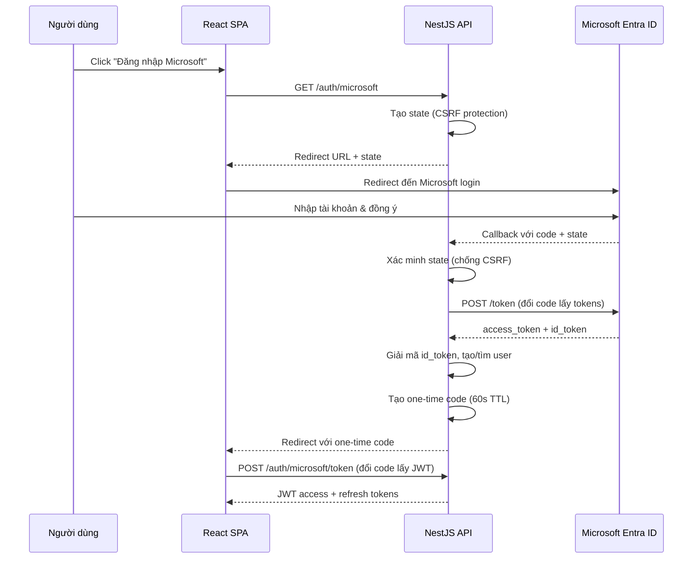
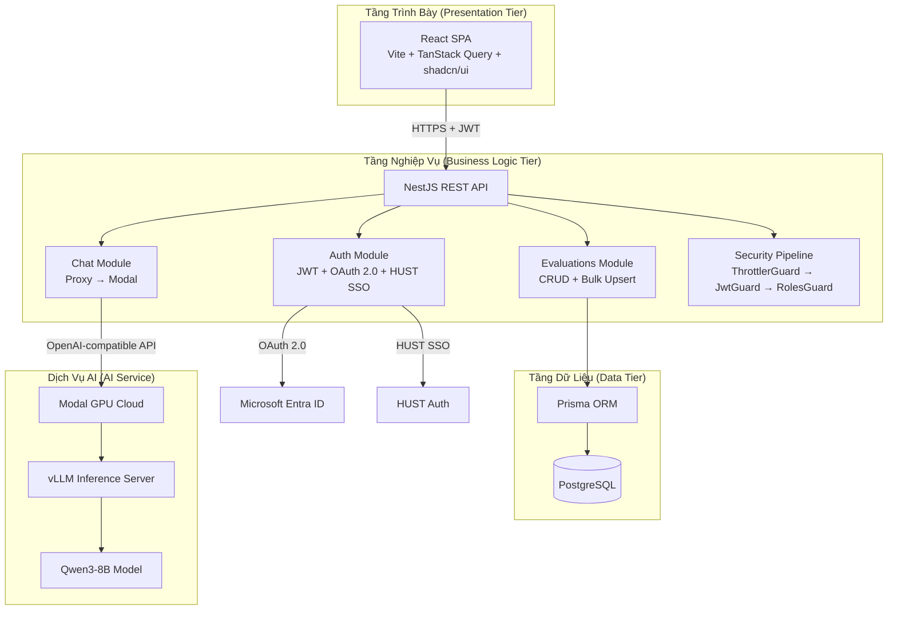

# Chương 2: Cơ Sở Lý Thuyết và Công Nghệ

## 2.1 Các Khái Niệm Liên Quan

### 2.1.1 Kiến trúc ứng dụng web hiện đại (SPA + REST API)

Kiến trúc ứng dụng web hiện đại phổ biến nhất hiện nay là mô hình tách rời (decoupled) giữa **Single-Page Application (SPA)** ở phía client và **RESTful API** ở phía server.

**SPA** là ứng dụng web chỉ tải một trang HTML duy nhất, sau đó sử dụng JavaScript để cập nhật giao diện động mà không cần tải lại toàn bộ trang. Khi người dùng điều hướng giữa các màn hình, SPA chỉ trao đổi dữ liệu JSON với server thông qua API, giúp trải nghiệm mượt mà tương tự ứng dụng desktop.

**REST (Representational State Transfer)** là phong cách kiến trúc cho các API phân tán, sử dụng các phương thức HTTP chuẩn (GET, POST, PUT, DELETE) để thao tác tài nguyên. Mỗi tài nguyên được định danh bằng URL duy nhất, và server không lưu trạng thái phiên (stateless) — mọi thông tin xác thực được gửi kèm trong mỗi request.

Trong khóa luận này, mô hình SPA + REST API được lựa chọn vì: (1) cho phép phát triển frontend và backend độc lập, (2) frontend có thể triển khai trên CDN để tăng tốc, (3) API có thể phục vụ nhiều loại client trong tương lai (mobile, CLI).

### 2.1.2 Xác thực và ủy quyền

**Xác thực (Authentication)** là quá trình xác minh danh tính người dùng — trả lời câu hỏi "Bạn là ai?". **Ủy quyền (Authorization)** là quá trình kiểm tra quyền truy cập — trả lời câu hỏi "Bạn được phép làm gì?".

**JSON Web Token (JWT)** là một chuẩn mở (RFC 7519) để truyền thông tin xác thực giữa các bên dưới dạng đối tượng JSON được ký số. Một JWT gồm ba phần: Header (thuật toán ký), Payload (dữ liệu người dùng), và Signature (chữ ký xác minh). JWT phù hợp với kiến trúc stateless vì server không cần lưu session — chỉ cần xác minh chữ ký của token.

Hệ thống trong khóa luận sử dụng cặp **access token** (thời hạn 15 phút) và **refresh token** (thời hạn 3 giờ) kết hợp **tokenVersion** để hỗ trợ thu hồi token — khi phát hiện bất thường, quản trị viên tăng tokenVersion để vô hiệu hóa tất cả refresh token đã cấp.

**OAuth 2.0** là khung giao thức ủy quyền cho phép ứng dụng bên thứ ba truy cập tài nguyên của người dùng trên một dịch vụ khác mà không cần biết mật khẩu. Luồng Authorization Code — phù hợp nhất cho ứng dụng web — hoạt động qua các bước: (1) chuyển hướng người dùng đến nhà cung cấp (Microsoft), (2) người dùng đăng nhập và đồng ý, (3) nhà cung cấp trả về authorization code, (4) server đổi code lấy access token và id_token.

### 2.1.3 Phân quyền dựa trên vai trò (RBAC)

**Role-Based Access Control (RBAC)** là mô hình phân quyền trong đó quyền truy cập được gán cho các vai trò (role), và người dùng được gán vào các vai trò. So với mô hình ACL (Access Control List) gán quyền trực tiếp cho từng người dùng, RBAC đơn giản hóa quản lý khi số lượng người dùng lớn.

Hệ thống trong khóa luận mở rộng RBAC truyền thống bằng **bảng RolePermission** cho phép cấu hình quyền truy cập kết quả đánh giá theo bốn mức: `none` (không xem), `self` (chỉ xem của mình), `group` (xem trong nhóm), `all` (xem tất cả). Cơ chế này cho phép thay đổi chính sách truy cập tại runtime mà không cần sửa mã nguồn hay triển khai lại.

### 2.1.4 Object-Relational Mapping (ORM)

**ORM** là kỹ thuật ánh xạ giữa đối tượng trong ngôn ngữ lập trình và bảng trong cơ sở dữ liệu quan hệ. ORM cho phép lập trình viên thao tác dữ liệu thông qua đối tượng và phương thức thay vì viết SQL thủ công, giảm lỗi SQL injection và tăng tính an toàn kiểu (type safety).

### 2.1.5 Mô hình ngôn ngữ lớn (LLM)

**Large Language Model (LLM)** là mô hình học sâu được huấn luyện trên lượng lớn dữ liệu văn bản, có khả năng hiểu và sinh ngôn ngữ tự nhiên. Kiến trúc nền tảng là **Transformer** (Vaswani et al., 2017) với cơ chế self-attention cho phép mô hình xử lý mối quan hệ giữa các từ trong ngữ cảnh dài.

Các LLM mã nguồn mở hiện đại như Qwen3, LLaMA 3, và Mistral có khả năng: hội thoại đa lượt (multi-turn conversation), suy luận (chain-of-thought reasoning), và hiểu đa ngôn ngữ bao gồm tiếng Việt. Việc triển khai LLM yêu cầu GPU chuyên dụng — các nền tảng đám mây GPU-as-a-Service như Modal cho phép triển khai mô hình mà không cần sở hữu phần cứng.

### 2.1.6 Đánh giá đồng nghiệp 360 độ

**Đánh giá 360 độ (360-degree feedback)** là phương pháp đánh giá trong đó một cá nhân được đánh giá bởi nhiều nguồn: cấp trên, đồng nghiệp, cấp dưới, và tự đánh giá. Trong bối cảnh học thuật, phương pháp này được áp dụng cho giảng viên trong cùng nhóm chuyên môn — mỗi người đánh giá các đồng nghiệp theo nhiều tiêu chí (giảng dạy, phục vụ, tận tụy, hợp tác, tuân thủ) trên thang điểm định lượng.

Ưu điểm: giảm thiên kiến từ một nguồn đánh giá duy nhất, cung cấp góc nhìn đa chiều. Thách thức: đảm bảo tính ẩn danh để người đánh giá không ngại cho điểm thấp, và quản lý khối lượng đánh giá khi số lượng giảng viên lớn.

---

## 2.2 Công Nghệ Sử Dụng

### 2.2.1 NestJS — Backend Framework

**NestJS** là framework Node.js cho phía server, lấy cảm hứng từ Angular với kiến trúc module hóa, Dependency Injection (DI) tích hợp sẵn, và hỗ trợ TypeScript native. NestJS tổ chức mã nguồn theo các module, mỗi module chứa controller (xử lý HTTP), service (logic nghiệp vụ), và provider (các thành phần hỗ trợ).

**Lý do lựa chọn cho khóa luận:**
- Kiến trúc module hóa phù hợp với yêu cầu tách biệt các domain: auth, evaluations, staff, groups
- DI container cho phép mock service trong unit test (250 test cases)
- Pipeline Guard → Interceptor → Filter chuẩn hóa xử lý cross-cutting concerns
- Hệ sinh thái phong phú: `@nestjs/passport` cho JWT, `@nestjs/throttler` cho rate limiting, `@nestjs/swagger` cho API documentation

| Tiêu chí | NestJS | Express.js | Fastify | Spring Boot |
|-----------|--------|------------|---------|-------------|
| Ngôn ngữ | TypeScript | JavaScript | JavaScript | Java/Kotlin |
| DI tích hợp | Co | Khong | Khong | Co |
| Module hóa | Tich hop san | Thu cong | Thu cong | Co (Spring) |
| Hieu nang | Trung binh | Trung binh | Cao | Cao |
| Hoc tap | Trung binh | Thap | Thap | Cao |
| Test support | Tich hop | Thu cong | Thu cong | Tich hop |
| Phu hop KLTN | **Cao** | Thap | Trung binh | Qua nang |

: So sánh các backend framework phổ biến cho ứng dụng web

NestJS được chọn vì cân bằng tốt nhất giữa cấu trúc (module, DI, guard pipeline) và tốc độ phát triển. Express.js thiếu cấu trúc sẵn có, còn Spring Boot yêu cầu hệ sinh thái Java nặng nề hơn mức cần thiết cho quy mô khóa luận.

### 2.2.2 React — Frontend Library

**React** là thư viện JavaScript do Meta phát triển để xây dựng giao diện người dùng dựa trên thành phần (component-based). React sử dụng Virtual DOM để tối ưu cập nhật giao diện, và mô hình one-way data flow giúp luồng dữ liệu dễ theo dõi và debug.

**Lý do lựa chọn cho khóa luận:**
- Hệ sinh thái lớn nhất: TanStack Query cho server state, React Router cho điều hướng, shadcn/ui cho component library
- Component model phù hợp với nhiều dạng giao diện đánh giá (form, bảng, biểu đồ, chat widget)
- Code splitting với `React.lazy()` giảm thời gian tải trang ban đầu
- Cộng đồng và tài liệu phong phú, hỗ trợ tốt cho việc nghiên cứu và phát triển

### 2.2.3 Prisma — ORM

**Prisma** là ORM thế hệ mới cho Node.js và TypeScript, sử dụng file schema khai báo (`schema.prisma`) làm nguồn chân lý duy nhất cho cấu trúc cơ sở dữ liệu. Từ schema, Prisma tự động sinh ra: (1) Prisma Client với API truy vấn type-safe, (2) migration SQL, và (3) kiểu TypeScript cho mọi model.

**Lý do lựa chọn cho khóa luận:**
- Type-safe queries: lỗi truy vấn được phát hiện tại compile-time thay vì runtime
- Schema file phục vụ tốt vai trò tài liệu thiết kế CSDL trong khóa luận
- Migration tự động đảm bảo schema và CSDL luôn đồng bộ
- Hỗ trợ transaction cho các thao tác nguyên tử (bulk upsert đánh giá)

| Tiêu chí | Prisma | TypeORM | Sequelize | Drizzle |
|-----------|--------|---------|-----------|---------|
| Type safety | Compile-time | Runtime | Runtime | Compile-time |
| Schema definition | Khai bao (DSL) | Decorator/Entity | Model class | TypeScript |
| Migration | Tu dong | Tu dong | Thu cong | Tu dong |
| Query builder | Generated client | Active Record/Query Builder | Method chaining | SQL-like |
| Learning curve | Thap | Trung binh | Trung binh | Thap |
| Tai lieu | Xuat sac | Tot | Trung binh | Dang phat trien |
| Phu hop KLTN | **Cao** | Trung binh | Thap | Trung binh |

: So sánh các ORM phổ biến cho Node.js

Prisma được chọn vì schema khai báo trực quan (phù hợp trình bày trong khóa luận), type safety mạnh nhất trong các ORM Node.js, và migration tự động giảm rủi ro drift giữa code và database.

### 2.2.4 PostgreSQL — Cơ sở dữ liệu

**PostgreSQL** là hệ quản trị cơ sở dữ liệu quan hệ mã nguồn mở, nổi bật với tính tuân thủ ACID, hỗ trợ kiểu dữ liệu phong phú (JSON, Array, Enum), và hệ thống indexing mạnh mẽ (B-tree, GIN, GiST).

**Lý do lựa chọn cho khóa luận:**
- Composite unique constraint (`reviewer + evaluatee + group + question + period`) đảm bảo không trùng đánh giá tại mức CSDL
- Enum type native cho `AppRole`, `Gender`, `PeriodStatus` — an toàn hơn string column
- Compound indexes tối ưu cho các truy vấn đánh giá phức tạp (9 indexes trên bảng Evaluation)
- Miễn phí, mã nguồn mở, phổ biến trong môi trường học thuật

### 2.2.5 TanStack Query — Server State Management

**TanStack Query** (trước đây là React Query) là thư viện quản lý trạng thái server cho React. Thay vì lưu dữ liệu từ API vào Redux store và tự quản lý cache/refetch, TanStack Query cung cấp: tự động cache, refetch khi window focus, deduplication request, và stale-while-revalidate strategy.

**Lý do lựa chọn cho khóa luận:**
- Tách biệt server state (dữ liệu từ API) và client state (UI state) — mô hình rõ ràng hơn Redux
- Query key system (`queryKeys.ts`) cho phép invalidation chính xác khi dữ liệu thay đổi
- Giảm boilerplate đáng kể so với Redux: không cần action, reducer, middleware
- Tự động xử lý loading, error, retry states

### 2.2.6 Vite — Build Tool

**Vite** là build tool thế hệ mới cho ứng dụng web, sử dụng ES modules native trong development (khởi động server gần như tức thì) và Rollup cho production build (tree-shaking, code splitting). So với Webpack, Vite có thời gian khởi động development nhanh hơn 10-100x nhờ không cần bundle toàn bộ ứng dụng trước khi serve.

### 2.2.7 Qwen3 — Mô hình ngôn ngữ lớn

**Qwen3** là dòng mô hình ngôn ngữ lớn mã nguồn mở do Alibaba Cloud phát triển (phát hành tháng 4/2025), được huấn luyện trên 36 nghìn tỷ token bao gồm 119 ngôn ngữ. Qwen3 có hai dạng kiến trúc:

- **Dense models** (0.6B, 1.7B, 4B, 8B, 14B, 32B): mọi tham số được kích hoạt cho mỗi token
- **Mixture-of-Experts (MoE)** (30B-A3B, 235B-A22B): chỉ kích hoạt một tập con tham số, giảm chi phí tính toán

Tính năng nổi bật: **dual-mode thinking** — cùng một mô hình có thể chuyển đổi giữa chế độ suy luận sâu (chain-of-thought) và trả lời nhanh trực tiếp mà không cần hai mô hình riêng.

**Lý do lựa chọn cho khóa luận:**
- Hỗ trợ tiếng Việt tốt nhất trong các LLM mã nguồn mở (do Alibaba tập trung vào CJK và Đông Nam Á)
- Qwen3-8B FP8 chạy được trên GPU T4 16GB (phù hợp free tier Modal)
- Qwen3-4B đạt chất lượng tương đương Qwen2.5-7B — hiệu quả tham số cao
- Mã nguồn mở (Apache 2.0), miễn phí sử dụng

| Tiêu chí | Qwen3-8B | LLaMA 3.1-8B | Mistral 7B | Gemma 2-9B |
|-----------|----------|--------------|------------|------------|
| Tieng Viet | Tot | Trung binh | Yeu | Trung binh |
| Context window | 128K | 128K | 32K | 8K |
| VRAM (FP8) | ~8 GB | ~8 GB | ~7 GB | ~9 GB |
| Dual-mode thinking | Co | Khong | Khong | Khong |
| Giay phep | Apache 2.0 | Meta License | Apache 2.0 | Google License |
| vLLM support | Co | Co | Co | Co |
| Phu hop KLTN | **Cao** | Trung binh | Thap | Trung binh |

: So sánh các mô hình ngôn ngữ lớn mã nguồn mở 7-9B tham số

Qwen3-8B được chọn vì chất lượng tiếng Việt vượt trội, context window 128K cho phép hội thoại dài, và tính năng dual-mode thinking cho phép chatbot vừa giải thích chi tiết vừa trả lời nhanh tùy ngữ cảnh.

### 2.2.8 Modal — Nền tảng GPU đám mây

**Modal** là nền tảng serverless GPU cloud cho phép triển khai mã Python lên GPU từ xa mà không cần quản lý infrastructure. Modal cung cấp: GPU on-demand (T4, L4, A10G, A100, H100), tính phí theo giây, auto-scaling từ 0 đến N container, và web endpoint công khai.

**Lý do lựa chọn cho khóa luận:**
- Free tier $30/tháng — đủ ~50 giờ GPU T4 cho demo và phát triển
- Triển khai đơn giản: một file Python + `modal deploy` — không cần Docker, Kubernetes
- Web endpoint tương thích OpenAI API — NestJS gọi như gọi API thông thường
- Auto-scale xuống 0 khi không sử dụng, tiết kiệm credits

### 2.2.9 vLLM — Inference Engine

**vLLM** là thư viện suy luận LLM hiệu suất cao, sử dụng kỹ thuật **PagedAttention** để quản lý bộ nhớ GPU hiệu quả — cho phép phục vụ nhiều request đồng thời với cùng lượng VRAM. vLLM cung cấp API endpoint tương thích OpenAI, hỗ trợ streaming, và tối ưu cho throughput cao.

**Lý do lựa chọn cho khóa luận:**
- API tương thích OpenAI — NestJS backend gọi cùng format với GPT API, dễ thay đổi model sau này
- PagedAttention tối ưu VRAM — phục vụ nhiều cuộc hội thoại trên cùng GPU T4
- Hỗ trợ quantization (FP8, INT4) để chạy model lớn trên GPU nhỏ

---

## 2.3 Kiến Trúc Tổng Thể Hệ Thống

Dựa trên các công nghệ đã trình bày, hệ thống được thiết kế theo kiến trúc ba tầng (three-tier) kết hợp dịch vụ AI bên ngoài:

Kiến trúc này đảm bảo:
- **Tách biệt quan tâm (Separation of Concerns):** Mỗi tầng chịu trách nhiệm một khía cạnh riêng
- **Khả năng thay thế:** Có thể thay Qwen bằng model khác mà không ảnh hưởng frontend, thay React bằng framework khác mà không ảnh hưởng API
- **Bảo mật theo chiều sâu:** Frontend không bao giờ giao tiếp trực tiếp với CSDL hay dịch vụ AI

---

## 2.4 Các Nghiên Cứu và Hệ Thống Liên Quan

### 2.4.1 Google Forms / Microsoft Forms

Nhiều đơn vị giáo dục sử dụng Google Forms hoặc Microsoft Forms để thu thập đánh giá. Ưu điểm: triển khai nhanh, miễn phí, không cần phát triển phần mềm. Hạn chế: không có phân quyền chi tiết (tất cả người có link đều xem được kết quả), không hỗ trợ đánh giá ẩn danh thực sự, không tích hợp hệ thống xác thực tổ chức, và báo cáo giới hạn ở biểu đồ đơn giản — không có radar chart hay bảng xếp hạng.

### 2.4.2 BambooHR — Performance Management

**BambooHR** là nền tảng quản lý nhân sự thương mại cung cấp module đánh giá hiệu suất 360 độ. Hệ thống hỗ trợ: đánh giá định lượng và định tính, workflow phê duyệt nhiều cấp, dashboard phân tích, và tích hợp SSO. Tuy nhiên, BambooHR thiết kế cho doanh nghiệp tổng quát — không tối ưu cho đặc thù đánh giá giảng viên đại học (nhóm chuyên môn, kỳ đánh giá, tiêu chí học thuật). Chi phí bản quyền cao và không cho phép tùy chỉnh sâu.

### 2.4.3 Lattice — People Management Platform

**Lattice** là nền tảng SaaS quản lý hiệu suất nhân viên, cung cấp: đánh giá 360 độ, OKR tracking, 1-on-1 meeting notes, và khảo sát mức độ hài lòng. Lattice có giao diện hiện đại và API mở rộng, nhưng tương tự BambooHR — thiết kế cho doanh nghiệp, giá cao ($11/user/tháng), và không hỗ trợ ngôn ngữ tiếng Việt.

### 2.4.4 Moodle — Learning Management System

**Moodle** là hệ thống quản lý học tập mã nguồn mở được nhiều trường đại học sử dụng. Moodle có plugin Workshop cho phép peer assessment, nhưng tập trung vào đánh giá bài tập sinh viên — không phải đánh giá giảng viên. Kiến trúc monolithic PHP khiến việc mở rộng và tích hợp AI khó khăn hơn so với kiến trúc hiện đại.

### 2.4.5 Các nghiên cứu về ứng dụng LLM trong giáo dục

Gần đây, nhiều nghiên cứu đã khám phá việc tích hợp LLM vào hệ thống giáo dục: chatbot hỗ trợ học tập (Khan Academy's Khanmigo), trợ lý ảo cho giảng viên (Georgia Tech's Jill Watson), và hệ thống hỏi đáp tự động. Tuy nhiên, việc ứng dụng LLM vào quy trình đánh giá cán bộ — đặc biệt với mô hình mã nguồn mở và triển khai serverless — vẫn là hướng nghiên cứu mới, và là điểm khác biệt của khóa luận này.

### Bảng so sánh tổng hợp

| Tiêu chí | Google Forms | BambooHR | Lattice | Moodle | **He thong KLTN** |
|-----------|-------------|----------|---------|--------|-------------------|
| Danh gia 360 do | Khong | Co | Co | Han che | **Co** |
| Phan quyen RBAC | Khong | Co | Co | Co | **Co (dong)** |
| An danh | Khong | Co | Co | Co | **Co** |
| SSO to chuc | Khong | Co | Co | Co | **Co (Microsoft + HUST)** |
| Bieu do radar | Khong | Co | Co | Khong | **Co** |
| Xuat CSV | Han che | Co | Co | Co | **Co** |
| Chatbot AI | Khong | Khong | Khong | Khong | **Co (Qwen3)** |
| Tieng Viet | Co | Khong | Khong | Co | **Co** |
| Ma nguon mo | Khong | Khong | Khong | Co | **Co** |
| Chi phi | Mien phi | $6/user/thang | $11/user/thang | Mien phi | **Mien phi** |
| Tuy chinh | Thap | Thap | Trung binh | Cao | **Cao** |

: So sánh hệ thống khóa luận với các giải pháp đánh giá hiện có

Hệ thống của khóa luận khác biệt ở: (1) thiết kế chuyên biệt cho đánh giá giảng viên đại học Việt Nam, (2) phân quyền động cấu hình tại runtime, (3) tích hợp chatbot AI mã nguồn mở hỗ trợ tiếng Việt, và (4) mã nguồn mở, miễn phí, có thể tự triển khai.

---

## 2.5 Tổng Kết Chương

Chương này đã trình bày cơ sở lý thuyết và công nghệ nền tảng cho việc xây dựng Hệ thống Đánh giá Cán bộ Giảng viên. Các khái niệm chính bao gồm: kiến trúc SPA + REST API cho ứng dụng web hiện đại, xác thực JWT và OAuth 2.0 cho bảo mật đa nguồn, phân quyền RBAC cho kiểm soát truy cập linh hoạt, ORM cho thao tác dữ liệu an toàn kiểu, và LLM cho chatbot hỗ trợ thông minh.

Về công nghệ, hệ thống sử dụng NestJS (backend có cấu trúc module, DI, và pipeline bảo mật), React + TanStack Query (frontend SPA với quản lý server state hiệu quả), Prisma + PostgreSQL (tầng dữ liệu type-safe), và Qwen3 + vLLM + Modal (dịch vụ AI serverless). Mỗi lựa chọn công nghệ đều được so sánh với các phương án thay thế và đánh giá dựa trên tiêu chí phù hợp với quy mô và yêu cầu khóa luận.

Phần khảo sát các hệ thống liên quan cho thấy: các giải pháp hiện có hoặc thiếu tính chuyên biệt cho đánh giá giảng viên (Google Forms, Moodle), hoặc có chi phí cao và không hỗ trợ tiếng Việt (BambooHR, Lattice), hoặc thiếu tích hợp AI (tất cả). Hệ thống của khóa luận lấp đầy khoảng trống này với giải pháp mã nguồn mở, chuyên biệt, tích hợp chatbot AI, và hoàn toàn hỗ trợ tiếng Việt.

Chương tiếp theo sẽ trình bày chi tiết phân tích yêu cầu và thiết kế hệ thống — bao gồm thiết kế cơ sở dữ liệu, thiết kế API, thiết kế bảo mật, và thiết kế tích hợp chatbot AI.
