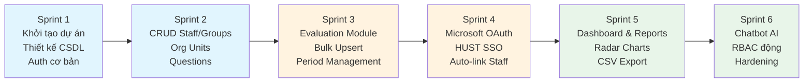
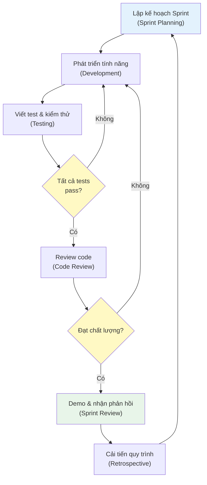

# Chương 3: Phương Pháp Nghiên Cứu và Phân Tích Yêu Cầu

## 3.1 Quy Trình Phát Triển

### 3.1.1 Lựa chọn mô hình phát triển

Khóa luận áp dụng phương pháp phát triển **Agile** theo mô hình **Scrum đơn giản hóa** (Simplified Scrum) — phù hợp với nhóm phát triển quy mô nhỏ (1-2 người) và yêu cầu có thể thay đổi trong quá trình nghiên cứu.

**Lý do lựa chọn Agile thay vì Waterfall:**

| Tiêu chí | Waterfall | Agile/Scrum | Phù hợp KLTN |
|-----------|-----------|-------------|--------------|
| Yêu cầu thay đổi | Khó thích ứng | Linh hoạt | Agile (yêu cầu tinh chỉnh qua các iteration) |
| Phản hồi | Cuối dự án | Mỗi sprint | Agile (nhận phản hồi từ GVHD sớm) |
| Rủi ro | Phát hiện muộn | Phát hiện sớm | Agile (phát hiện lỗi thiết kế qua prototype) |
| Tài liệu | Nặng | Vừa đủ | Agile (tập trung vào sản phẩm hoạt động) |
| Kiểm thử | Sau triển khai | Liên tục | Agile (250 test cases chạy mỗi commit) |

: So sánh mô hình phát triển Waterfall và Agile

### 3.1.2 Quy trình phát triển cụ thể

Dự án được chia thành 6 sprint, mỗi sprint kéo dài 2-3 tuần:

Mỗi sprint tuân theo quy trình:

### 3.1.3 Công cụ hỗ trợ phát triển

| Công cụ | Mục đích |
|---------|----------|
| Git + GitHub | Quản lý mã nguồn, version control |
| Jest + Vitest | Kiểm thử tự động (backend + frontend) |
| Prisma Migrate | Quản lý migration cơ sở dữ liệu |
| Swagger | Tài liệu API tự động |
| Docker Compose | Môi trường phát triển và triển khai |
| ESLint + Prettier | Đảm bảo coding standards |

---

## 3.2 Phân Tích Yêu Cầu

### 3.2.1 Yêu cầu chức năng

Các yêu cầu chức năng được phân loại theo module và mức ưu tiên: **Cao** (bắt buộc cho MVP), **Trung bình** (cần thiết nhưng không chặn MVP), **Thấp** (nâng cao trải nghiệm).

#### Module Xác thực (Authentication)

| ID | Tên | Mô tả | Ưu tiên |
|----|-----|-------|---------|
| FR-AU-01 | Đăng ký tài khoản | Người dùng đăng ký bằng email và mật khẩu. Hệ thống tạo tài khoản, profile, và gán vai trò `user` mặc định. | Cao |
| FR-AU-02 | Đăng nhập cục bộ | Người dùng đăng nhập bằng email/mật khẩu. Hệ thống trả về cặp access token (15 phút) và refresh token (3 giờ). | Cao |
| FR-AU-03 | Đăng nhập Microsoft OAuth | Người dùng đăng nhập bằng tài khoản Microsoft tổ chức (@hust.edu.vn). Hệ thống tự động tạo tài khoản nếu chưa có. | Cao |
| FR-AU-04 | Đăng nhập HUST SSO | Người dùng đăng nhập bằng hệ thống SSO của HUST thông qua xác thực email trường. | Trung bình |
| FR-AU-05 | Tự động liên kết giảng viên | Sau đăng nhập/đăng ký, hệ thống tự động liên kết tài khoản với hồ sơ giảng viên thông qua khớp email trường học. | Cao |
| FR-AU-06 | Làm mới token | Khi access token hết hạn, frontend tự động sử dụng refresh token để lấy cặp token mới mà không yêu cầu đăng nhập lại. | Cao |
| FR-AU-07 | Xem thông tin cá nhân | Người dùng xem thông tin profile, vai trò, và hồ sơ giảng viên liên kết (nếu có). | Trung bình |

: Yêu cầu chức năng — Module Xác thực

#### Module Đánh giá (Evaluations)

| ID | Tên | Mô tả | Ưu tiên |
|----|-----|-------|---------|
| FR-EV-01 | Gửi đánh giá hàng loạt | Giảng viên gửi đánh giá cho một đồng nghiệp trên tất cả tiêu chí trong một lần gửi (bulk upsert). Điểm từ 0.0 đến 4.0. | Cao |
| FR-EV-02 | Xem đánh giá đã gửi | Giảng viên xem danh sách các đánh giá mình đã gửi, lọc theo nhóm và kỳ đánh giá. | Cao |
| FR-EV-03 | Xem đánh giá nhận được | Giảng viên xem đánh giá mình nhận được. Nếu kỳ đánh giá ẩn danh, danh tính người đánh giá bị ẩn. | Cao |
| FR-EV-04 | Xem tiến độ đánh giá | Giảng viên xem tỷ lệ hoàn thành đánh giá (bao nhiêu đồng nghiệp đã đánh giá / tổng số). | Trung bình |
| FR-EV-05 | Xem đánh giá chờ xử lý | Hệ thống hiển thị danh sách đồng nghiệp chưa được đánh giá trong kỳ hiện tại. | Trung bình |
| FR-EV-06 | Chặn tự đánh giá | Hệ thống không cho phép giảng viên đánh giá chính mình. | Cao |
| FR-EV-07 | Kiểm tra tư cách đánh giá | Chỉ giảng viên cùng nhóm với người được đánh giá mới được phép đánh giá. | Cao |

: Yêu cầu chức năng — Module Đánh giá

#### Module Quản trị (Administration)

| ID | Tên | Mô tả | Ưu tiên |
|----|-----|-------|---------|
| FR-AD-01 | CRUD cán bộ giảng viên | Admin tạo, xem, sửa, xóa hồ sơ giảng viên (tên, email, mã giảng viên, đơn vị, học vị). | Cao |
| FR-AD-02 | CRUD đơn vị tổ chức | Admin quản lý danh sách các khoa/viện. | Cao |
| FR-AD-03 | CRUD nhóm chuyên môn | Admin quản lý nhóm và phân công giảng viên vào nhóm. | Cao |
| FR-AD-04 | CRUD câu hỏi đánh giá | Admin quản lý tiêu chí đánh giá (kích hoạt/vô hiệu hóa). | Cao |
| FR-AD-05 | Quản lý kỳ đánh giá | Admin tạo kỳ đánh giá với ngày bắt đầu/kết thúc, kích hoạt/đóng kỳ. Tại mỗi thời điểm chỉ có tối đa một kỳ hoạt động. | Cao |
| FR-AD-06 | Cấu hình đánh giá ẩn danh | Admin bật/tắt chế độ ẩn danh cho từng kỳ đánh giá. | Trung bình |
| FR-AD-07 | Quản lý vai trò người dùng | Admin gán/thu hồi vai trò (admin, moderator, user) cho tài khoản. | Cao |
| FR-AD-08 | Cấu hình quyền truy cập kết quả | Admin thay đổi mức truy cập kết quả cho từng vai trò (none/self/group/all) tại runtime. | Trung bình |
| FR-AD-09 | Upload avatar giảng viên | Admin upload ảnh đại diện cho giảng viên (tối đa 2MB, định dạng ảnh). | Thấp |

: Yêu cầu chức năng — Module Quản trị

#### Module Báo cáo (Reporting)

| ID | Tên | Mô tả | Ưu tiên |
|----|-----|-------|---------|
| FR-RP-01 | Bảng điều khiển tổng quan | Dashboard hiển thị thống kê tổng hợp: số giảng viên, nhóm, kỳ đánh giá, tỷ lệ hoàn thành. | Cao |
| FR-RP-02 | Biểu đồ radar | Hiển thị điểm trung bình theo từng tiêu chí cho mỗi giảng viên dưới dạng radar chart. | Trung bình |
| FR-RP-03 | Bảng xếp hạng | Xếp hạng giảng viên theo điểm trung bình tổng hợp trong một kỳ đánh giá. | Trung bình |
| FR-RP-04 | Xuất dữ liệu CSV | Admin xuất kết quả đánh giá ra file CSV để xử lý ngoài hệ thống. | Trung bình |
| FR-RP-05 | Phân quyền xem kết quả | Kết quả đánh giá chỉ hiển thị theo mức quyền được cấu hình cho vai trò người dùng. | Cao |

: Yêu cầu chức năng — Module Báo cáo

#### Module Chatbot AI

| ID | Tên | Mô tả | Ưu tiên |
|----|-----|-------|---------|
| FR-CB-01 | Hội thoại tiếng Việt | Chatbot trả lời câu hỏi của người dùng bằng tiếng Việt tự nhiên. | Cao |
| FR-CB-02 | Hỏi đáp quy trình | Chatbot giải thích quy trình đánh giá, tiêu chí, và cách sử dụng hệ thống. | Cao |
| FR-CB-03 | Nhận biết ngữ cảnh | Chatbot biết vai trò, nhóm, và kỳ đánh giá hiện tại của người dùng để trả lời phù hợp. | Trung bình |
| FR-CB-04 | Giao diện chat tích hợp | Widget chat nổi (floating) trên mọi trang, mở rộng thành panel hội thoại. | Trung bình |

: Yêu cầu chức năng — Module Chatbot AI

### 3.2.2 Yêu cầu phi chức năng

| ID | Thuộc tính | Yêu cầu | Chỉ số đo lường |
|----|-----------|---------|-----------------|
| NFR-01 | Hiệu năng | Thời gian phản hồi API < 300ms (p95) với 50 người dùng đồng thời | Đo bằng LoggingInterceptor |
| NFR-02 | Bảo mật | Phòng chống OWASP Top 10: XSS (Helmet CSP), CSRF (OAuth state), SQL Injection (Prisma parameterized), Rate Limiting (ThrottlerGuard) | Kiểm tra thủ công + cấu hình |
| NFR-03 | Bảo mật | Mật khẩu phải được hash bằng bcrypt; JWT secret >= 32 ký tự trong production | Kiểm tra env validation |
| NFR-04 | Khả dụng | Hệ thống hoạt động >= 99% trong giờ hành chính trên single-node deployment | Monitoring |
| NFR-05 | Khả năng bảo trì | Kiến trúc module hóa NestJS; độ bao phủ test >= 60% trên services | Jest coverage report |
| NFR-06 | Khả năng triển khai | Triển khai được bằng Docker Compose trên bất kỳ máy chủ Linux nào | docker-compose.yml |
| NFR-07 | Khả năng sử dụng | Giao diện responsive, hoạt động trên desktop và mobile browsers | Kiểm thử trình duyệt |
| NFR-08 | Truy cập | Tuân thủ WCAG 2.1 AA cho các luồng chính (đánh giá, xem kết quả) | Lighthouse audit |
| NFR-09 | Chatbot | Thời gian phản hồi chatbot < 5 giây (warm container) | Đo thời gian API call |

: Yêu cầu phi chức năng

---

## 3.3 Biểu Đồ Use Case

### 3.3.1 Biểu đồ use case tổng quan

```mermaid
graph TB
    subgraph "Hệ thống Đánh giá Cán bộ Giảng viên"

        subgraph "Xác thực"
            UC1["UC-01: Đăng ký tài khoản"]
            UC2["UC-02: Đăng nhập"]
            UC3["UC-03: Đăng nhập Microsoft"]
            UC4["UC-04: Đăng nhập HUST SSO"]
        end

        subgraph "Đánh giá"
            UC5["UC-05: Gửi đánh giá đồng nghiệp"]
            UC6["UC-06: Xem đánh giá đã gửi"]
            UC7["UC-07: Xem đánh giá nhận được"]
            UC8["UC-08: Xem tiến độ"]
        end

        subgraph "Quản trị"
            UC9["UC-09: Quản lý cán bộ"]
            UC10["UC-10: Quản lý kỳ đánh giá"]
            UC11["UC-11: Quản lý nhóm"]
            UC12["UC-12: Cấu hình phân quyền"]
        end

        subgraph "Báo cáo"
            UC13["UC-13: Xem dashboard"]
            UC14["UC-14: Xuất CSV"]
        end

        subgraph "AI"
            UC15["UC-15: Hỏi đáp chatbot"]
        end
    end

    GV["Giảng viên<br/>(User)"]
    MOD["Trưởng nhóm<br/>(Moderator)"]
    ADM["Quản trị viên<br/>(Admin)"]

    GV --> UC1
    GV --> UC2
    GV --> UC3
    GV --> UC4
    GV --> UC5
    GV --> UC6
    GV --> UC7
    GV --> UC8
    GV --> UC13
    GV --> UC15

    MOD --> UC5
    MOD --> UC6
    MOD --> UC7
    MOD --> UC8
    MOD --> UC13
    MOD --> UC14
    MOD --> UC15

    ADM --> UC9
    ADM --> UC10
    ADM --> UC11
    ADM --> UC12
    ADM --> UC13
    ADM --> UC14
    ADM --> UC15
```

### 3.3.2 Mô tả chi tiết các use case

#### UC-05: Gửi đánh giá đồng nghiệp

| Mục | Nội dung |
|-----|----------|
| **ID** | UC-05 |
| **Tên** | Gửi đánh giá đồng nghiệp |
| **Actor** | Giảng viên (User) |
| **Mô tả** | Giảng viên chấm điểm một đồng nghiệp trong cùng nhóm chuyên môn trên tất cả tiêu chí đánh giá đang hoạt động |
| **Điều kiện tiên quyết** | (1) Người dùng đã đăng nhập và liên kết với hồ sơ giảng viên, (2) Tồn tại kỳ đánh giá đang hoạt động (status=active), (3) Ngày hiện tại nằm trong khoảng startDate–endDate |
| **Luồng chính** | 1. Giảng viên chọn nhóm chuyên môn từ danh sách nhóm mình tham gia → 2. Hệ thống hiển thị danh sách đồng nghiệp trong nhóm (trừ bản thân) → 3. Giảng viên chọn đồng nghiệp cần đánh giá → 4. Hệ thống hiển thị form với các tiêu chí đánh giá đang hoạt động → 5. Giảng viên nhập điểm (0.0–4.0) cho từng tiêu chí → 6. Giảng viên nhấn "Gửi đánh giá" → 7. Hệ thống xác thực toàn bộ dữ liệu trong transaction nguyên tử → 8. Hệ thống lưu/cập nhật đánh giá và hiển thị thông báo thành công |
| **Luồng ngoại lệ** | 4a. Giảng viên cố đánh giá bản thân → Hệ thống từ chối với thông báo lỗi. 5a. Điểm ngoài khoảng 0.0–4.0 → Hệ thống hiển thị lỗi validation inline. 7a. Kỳ đánh giá đã đóng giữa chừng → Hệ thống từ chối và thông báo kỳ đã kết thúc. 7b. Giảng viên không còn trong nhóm → Hệ thống từ chối. |
| **Kết quả** | Đánh giá được lưu vào CSDL với composite unique constraint (reviewer, evaluatee, group, question, period) — nếu đã tồn tại thì cập nhật điểm (upsert) |

: Đặc tả use case UC-05 — Gửi đánh giá đồng nghiệp

#### UC-03: Đăng nhập Microsoft OAuth 2.0

| Mục | Nội dung |
|-----|----------|
| **ID** | UC-03 |
| **Tên** | Đăng nhập Microsoft OAuth 2.0 |
| **Actor** | Giảng viên (User) |
| **Mô tả** | Giảng viên đăng nhập bằng tài khoản Microsoft tổ chức. Hệ thống tự động tạo tài khoản và liên kết với hồ sơ giảng viên nếu chưa có. |
| **Điều kiện tiên quyết** | (1) Người dùng có tài khoản Microsoft thuộc domain @hust.edu.vn, (2) Hệ thống đã cấu hình Microsoft OAuth client ID/secret |
| **Luồng chính** | 1. Người dùng nhấn "Đăng nhập bằng Microsoft" → 2. SPA gọi `GET /auth/microsoft` → 3. API tạo CSRF state và redirect đến Microsoft Entra ID → 4. Người dùng đăng nhập tại Microsoft và đồng ý cấp quyền → 5. Microsoft callback về API với authorization code + state → 6. API xác minh state (chống CSRF) → 7. API đổi code lấy id_token từ Microsoft → 8. API giải mã id_token, trích xuất email và tên → 9. API tìm hoặc tạo user (xử lý race condition P2002) → 10. API tự động liên kết với Staff qua email trường → 11. API tạo one-time code (TTL 60 giây) → 12. API redirect SPA với one-time code → 13. SPA đổi one-time code lấy JWT tokens |
| **Luồng ngoại lệ** | 5a. State không khớp → API từ chối (CSRF detected). 8a. Email không thuộc domain HUST → API từ chối đăng nhập. 9a. Race condition (hai request đồng thời tạo cùng user) → API retry với tìm user hiện có. |
| **Kết quả** | Người dùng đăng nhập thành công, nhận JWT tokens, profile tự động liên kết với hồ sơ giảng viên (nếu email khớp) |

: Đặc tả use case UC-03 — Đăng nhập Microsoft OAuth 2.0

#### UC-10: Quản lý kỳ đánh giá

| Mục | Nội dung |
|-----|----------|
| **ID** | UC-10 |
| **Tên** | Quản lý kỳ đánh giá |
| **Actor** | Quản trị viên (Admin) |
| **Mô tả** | Admin tạo, chỉnh sửa, kích hoạt, và đóng các kỳ đánh giá. Hệ thống đảm bảo tại mỗi thời điểm chỉ có tối đa một kỳ đang hoạt động. |
| **Điều kiện tiên quyết** | Người dùng có vai trò admin |
| **Luồng chính** | 1. Admin truy cập trang quản lý kỳ đánh giá → 2. Admin nhấn "Tạo kỳ mới" → 3. Admin nhập: tên, mô tả, ngày bắt đầu, ngày kết thúc, chế độ ẩn danh (bật/tắt) → 4. Hệ thống tạo kỳ với trạng thái `draft` → 5. Admin nhấn "Kích hoạt" → 6. Hệ thống kiểm tra không có kỳ khác đang active → 7. Hệ thống chuyển trạng thái sang `active` → 8. Giảng viên có thể bắt đầu đánh giá |
| **Luồng ngoại lệ** | 6a. Đã có kỳ đánh giá khác đang active → Hệ thống yêu cầu đóng kỳ cũ trước. 3a. Ngày kết thúc trước ngày bắt đầu → Validation error. |
| **Kết quả** | Kỳ đánh giá được tạo/cập nhật. Khi active, giảng viên có thể gửi đánh giá trong khoảng thời gian quy định. |

: Đặc tả use case UC-10 — Quản lý kỳ đánh giá

#### UC-07: Xem đánh giá nhận được

| Mục | Nội dung |
|-----|----------|
| **ID** | UC-07 |
| **Tên** | Xem đánh giá nhận được |
| **Actor** | Giảng viên (User) |
| **Mô tả** | Giảng viên xem danh sách đánh giá mình nhận được từ đồng nghiệp. Nếu kỳ đánh giá bật chế độ ẩn danh, danh tính người đánh giá bị ẩn ở tầng service. |
| **Điều kiện tiên quyết** | (1) Người dùng đã đăng nhập và liên kết giảng viên, (2) Quyền truy cập kết quả >= `self` |
| **Luồng chính** | 1. Giảng viên truy cập trang "Đánh giá nhận được" → 2. Hệ thống truy vấn đánh giá với evaluateeId = staffId của user → 3. Với mỗi đánh giá, hệ thống kiểm tra `period.isAnonymous` → 4a. Nếu ẩn danh và user không phải admin: thông tin reviewer bị loại bỏ → 4b. Nếu không ẩn danh hoặc user là admin: hiển thị đầy đủ → 5. Hệ thống trả về danh sách đánh giá |
| **Luồng ngoại lệ** | 2a. Quyền truy cập = `none` → Hệ thống từ chối truy cập. |
| **Kết quả** | Giảng viên xem được điểm đánh giá nhận được. Tính ẩn danh được bảo vệ tại server (không phụ thuộc frontend). |

: Đặc tả use case UC-07 — Xem đánh giá nhận được

#### UC-15: Hỏi đáp chatbot AI

| Mục | Nội dung |
|-----|----------|
| **ID** | UC-15 |
| **Tên** | Hỏi đáp chatbot AI |
| **Actor** | Giảng viên, Moderator, Admin |
| **Mô tả** | Người dùng hỏi chatbot về quy trình đánh giá, tiêu chí, hoặc cách sử dụng hệ thống bằng tiếng Việt tự nhiên. Chatbot trả lời dựa trên ngữ cảnh (vai trò, nhóm, kỳ đánh giá). |
| **Điều kiện tiên quyết** | (1) Người dùng đã đăng nhập, (2) Dịch vụ Modal endpoint đang hoạt động |
| **Luồng chính** | 1. Người dùng nhấn nút chat (góc dưới phải) → 2. Panel chat mở ra → 3. Người dùng nhập câu hỏi tiếng Việt → 4. Frontend gửi message đến `POST /api/chat` → 5. Backend inject system prompt (vai trò user, kỳ đánh giá, tiêu chí) → 6. Backend gọi Modal endpoint (OpenAI-compatible API) → 7. Qwen3 sinh câu trả lời → 8. Backend trả về response → 9. Frontend hiển thị câu trả lời trong chat panel |
| **Luồng ngoại lệ** | 6a. Modal endpoint không phản hồi (cold start > 30s) → Frontend hiển thị "Đang khởi động AI...". 6b. Credits hết → Backend trả lỗi, frontend hiển thị thông báo chatbot tạm không khả dụng. |
| **Kết quả** | Người dùng nhận câu trả lời tiếng Việt phù hợp ngữ cảnh về quy trình đánh giá |

: Đặc tả use case UC-15 — Hỏi đáp chatbot AI

---

## 3.4 Ma Trận Truy Vết Yêu Cầu

Ma trận dưới đây liên kết yêu cầu chức năng với use case và mục tiêu đề tài (Chương 1), đảm bảo mọi yêu cầu đều có nguồn gốc và mọi mục tiêu đều được hiện thực hóa:

| Mục tiêu (Chương 1) | Use Case | Yêu cầu chức năng |
|---------------------|----------|-------------------|
| MT-1: Nền tảng đánh giá trực tuyến | UC-05, UC-06, UC-07, UC-08 | FR-EV-01 → FR-EV-07 |
| MT-2: Phân quyền linh hoạt | UC-12 | FR-AD-07, FR-AD-08, FR-RP-05 |
| MT-3: Xác thực đa nguồn | UC-01, UC-02, UC-03, UC-04 | FR-AU-01 → FR-AU-07 |
| MT-4: Báo cáo trực quan | UC-13, UC-14 | FR-RP-01 → FR-RP-04 |
| MT-5: Chatbot AI | UC-15 | FR-CB-01 → FR-CB-04 |

: Ma trận truy vết yêu cầu — mục tiêu đề tài

---

## 3.5 Tổng Kết Chương

Chương này đã trình bày phương pháp phát triển (Agile/Scrum đơn giản hóa qua 6 sprint), phân tích yêu cầu hệ thống (32 yêu cầu chức năng phân theo 6 module, 9 yêu cầu phi chức năng), và đặc tả use case chi tiết (15 use case, trong đó 5 được mô tả đầy đủ).

Hệ thống có 6 module chính: Xác thực (7 yêu cầu), Đánh giá (7 yêu cầu), Quản trị (9 yêu cầu), Báo cáo (5 yêu cầu), và Chatbot AI (4 yêu cầu). Ma trận truy vết đảm bảo mọi mục tiêu đề tài đều được ánh xạ đến yêu cầu cụ thể.

Chương tiếp theo sẽ trình bày thiết kế hệ thống — bao gồm thiết kế kiến trúc, thiết kế cơ sở dữ liệu, thiết kế API, và thiết kế bảo mật — hiện thực hóa các yêu cầu đã phân tích trong chương này.
